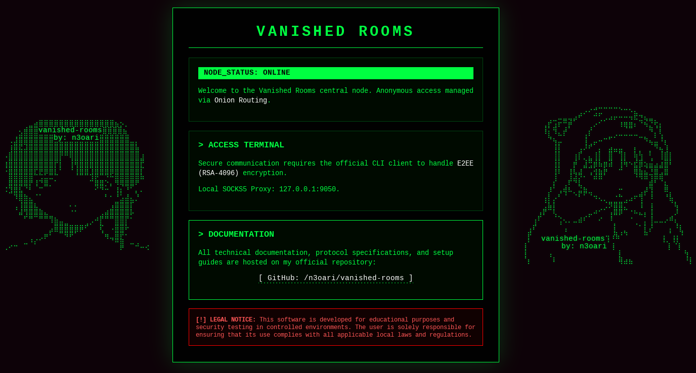

# VANISHED ROOMS

<p align="center">
  
  <br>
</p>

**Vanished Rooms** is a high-privacy, CLI-based messaging application developed in **Go**. It is designed to provide users with a secure, room-based communication environment where anonymity and data persistence are eliminated by design.

---

### 🛡️Key Features

- **Zero-Knowledge E2EE:** End-to-end encryption ensuring that only the participants can read the messages.
- **Hybrid Encryption Architecture:**
  - **Symmetric Encryption (AES):** Used for high-speed message encryption within the room.
  - **Asymmetric Encryption (RSA):** Utilized to securely distribute the AES session key among participants.

- **Highly Encrypted Public Messages Logs:** Transparency-driven storage where all message traffic is publicly accessible but remains strictly encrypted and unreadable to anyone outside the session
- **Anti-Forensics & Zero Logs:** No activity logs or metadata.

- **Anonymity via Tor:** Native routing through the Tor network to mask user IP addresses.
- **Server Amnesia:** The server is configured to wipe all volatile memory and restart periodically, ensuring total data clearance.
- **User-Centric Privacy Logic:**
  - **Instant Purge:** User data is immediately wiped upon disconnection.
  - **Self-Destructing Rooms:** Rooms are automatically deleted as soon as the last participant leaves.

    <br>

> Transparency Note: The server operates on a "glass box" principle. While the encrypted traffic is publicly visible for audit purposes, the E2EE layer ensures it is mathematically impossible to decrypt without the participants' private keys.

---

### P2P Architecture & Key Management

The application follows a decentralized **Peer-to-Peer (P2P)** logic for key distribution:

1.  **Room Creator (Host):** The user who initializes the room generates the master **AES key**.
2.  **Key Distribution:** The host is responsible for encrypting the AES key with the **RSA public keys** of joining participants and distributing it securely.
3.  **Dynamic Leadership:** If the host leaves the room, the role is automatically reassigned to the next user in line (determined by joining timestamp), ensuring the room's continuity and security without a central authority.

---

### Logic Communication Sequence


## Class diagram


<br>

## Room example


### Usage

> You will need a tor service running

> ❗Verify if the is the server in .onion is UP

```
http://wuopotpej2uap77giiz7xlpw5mqjdcmpjftmnxsprp6thjib2oyunoid.onion/
```

<br>

<p align="center">
   <br>
  
</p>

<br>

❗ You need tor daemon / service running

```bash
git clone https://github.com/n3oari/vanished-rooms.git
go mod tidy
Generate RSA: openssl genrsa -out privada.pem 2048
go run main.go client -u <username> -p <password> -k <path-private-rsa-key>
```

> You can also use the Makefile

### ❓Help menu (connected)

```bash
/create	-n <name> --public	Creates a public room visible to everyone.
/create	-n <name> -p <pass> --private	Creates a secure room (min. 8 characters password).
/rooms	None	Lists all currently active public rooms.
/join	-n <name> [-p <pass>]	Joins a room. Password is only required for private rooms (6 max users in room).
/leave-room	None	Exits the current room without disconnecting from the server.
/users	None	Lists all users currently present in your room.
/help	None	Displays the in-app help menu with ASCII styling.
/quit	None	Disconnects from the network and purges your data permanently.
```

> Examples

```bash
# Private room: Requires password
/create -n secret_vault -p 1234 --private

# Public room: No password needed
/create -n global_lobby --public

# Joining
/join -n global_lobby  (to public room)
/join -n secret_vault -p 1234 (to private room)

```

🧪 Debug Mode (dev branch)
Switch to the dev branch to inspect the system’s inner workings. Integrated debuggers allow you to monitor:

    Key Exchanges: View the handshake and security negotiation.

    Encrypted Messaging: Inspect payloads before and after encryption.

    Under-the-hood Logs: Track real-time data flow and protocol logic.

    Quick Start:
    git checkout dev
    go run . server

    connects to multiple clients and tests the functionalities

🤝 Contributing

Contributions, issues, and feature requests are welcome! Feel free to check the issues page.
