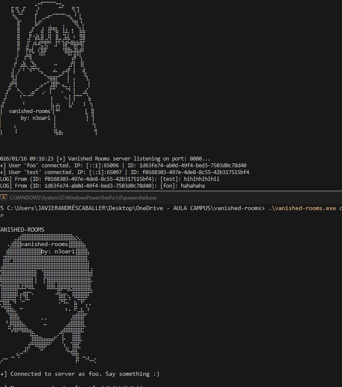

# VANISHED ROOMS

<p align="center">
  
  <br>
</p>


**Vanished Rooms** is a high-privacy, CLI-based messaging application developed in **Go**. It is designed to provide users with a secure, room-based communication environment where anonymity and data persistence are eliminated by design.

---

### Key Features

- **Zero-Knowledge E2EE:** End-to-end encryption ensuring that only the participants can read the messages.
- **Hybrid Encryption Architecture:**
  - **Symmetric Encryption (AES):** Used for high-speed message encryption within the room.
  - **Asymmetric Encryption (RSA):** Utilized to securely distribute the AES session key among participants.
- **Anti-Forensics & Zero Logs:** No activity logs or metadata are stored at any point.
- **Anonymity via Tor:** Native routing through the Tor network to mask user IP addresses.
- **Server Amnesia:** The server is configured to wipe all volatile memory and restart periodically, ensuring total data clearance. [DEV]
- **User-Centric Privacy Logic:**
  - **Instant Purge:** User data is immediately wiped upon disconnection.
  - **Self-Destructing Rooms:** Rooms are automatically deleted as soon as the last participant leaves.

---

### P2P Architecture & Key Management

The application follows a decentralized **Peer-to-Peer (P2P)** logic for key distribution:

1.  **Room Creator (Host):** The user who initializes the room generates the master **AES key**.
2.  **Key Distribution:** The host is responsible for encrypting the AES key with the **RSA public keys** of joining participants and distributing it securely.
3.  **Dynamic Leadership:** If the host leaves the room, the role is automatically reassigned to the next user in line (determined by joining timestamp), ensuring the room's continuity and security without a central authority.

---

### Logic Sequence


### Usage

> Verify if the only is the server in .onion is UP

```
http://wuopotpej2uap77giiz7xlpw5mqjdcmpjftmnxsprp6thjib2oyunoid.onion/
```

```bash
git clone https://github.com/n3oari/vanished-rooms.git
go mod tidy
Generate RSA: openssl genrsa -out privada.pem 2048  
go run main.go client -u <username> -p <password> -k <path-private-rsa-key>
```

> You can also use the Makefile

### Help menu (connected)

```bash
/create	-n <name> -p <pass> --private <y/n>	Create a new room and join automatically.
/rooms	None	List all currently active rooms.
/join	-n <name> -p <pass>	Join an existing room using credentials.
/leave-room	None	Exit the current room.
/users	None	List all users in your current room.
/help	None	Display the help menu.
/quit	None	Disconnect and remove your user permanently.
```

<p align="center">
   <br>
  
</p>
